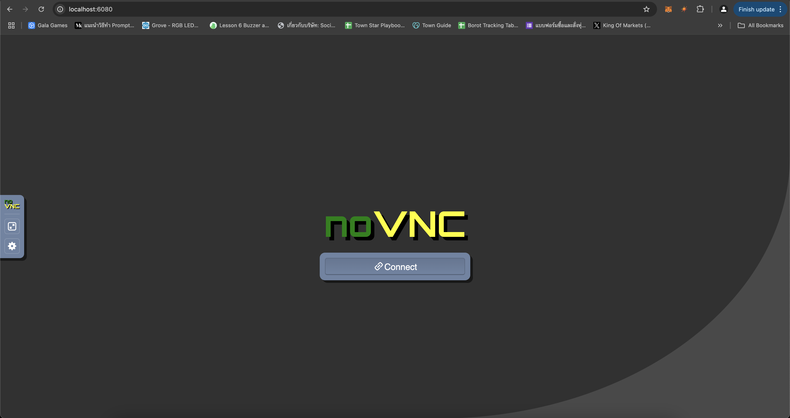

# Articulated-6-Dof-Robot

This repository contains the steps to set up and control an articulated 6-DOF robotic arm using Docker and ROS2.

---

## 🛠️ Prerequisites

- **For Linux:** Ensure Docker and Docker Compose are installed.
- **For Windows/macOS:** Install Docker Desktop (see instructions below).

### Install Docker Compose (For Linux)
Ensure Docker Compose is installed:
```sh
sudo apt-get update
sudo apt-get install docker-compose
```

---

## 💻 Installing Docker Desktop (Windows/macOS)

### **For Windows:**
1. Download Docker Desktop from the official website:
   [Docker Desktop for Windows](https://www.docker.com/products/docker-desktop/).
2. Run the installer and follow the instructions.
3. During installation:
   - Enable the option for **WSL 2 Backend** (required for Docker to run on Windows).
   - Restart your machine if prompted.
4. Verify installation:
   ```powershell
   docker --version
   docker-compose --version
   ```

### **For macOS:**
1. Download Docker Desktop from the official website:
   [Docker Desktop for Mac](https://www.docker.com/products/docker-desktop/).
2. Open the `.dmg` file and drag the Docker icon to your Applications folder.
3. Launch Docker Desktop from Applications and follow the setup instructions.
4. Verify installation:
   ```sh
   docker --version
   docker-compose --version
   ```

---

## 🚀 Tutorial

### 1️⃣ Clone the Repository
Navigate to your workspace and clone this repository:
```sh
git clone https://github.com/KobchokTime/Articulated-6-Dof-Robot.git -b Software-Team
cd Articulated-6-Dof-Robot
```

### 2️⃣ Build the Docker Image
Build the Docker image using the provided `Dockerfile`:
```sh
sudo docker build -t robot-arm-image .
```

### 3️⃣ Run a Container from the Image
Run the container with the following command:
```sh
sudo docker run -it --rm \
    -p 6080:80 \
    --device=/dev/ttyUSB0 \
    --device=/dev/ttyACM0 \
    --privileged \
    --shm-size=4096m \
    --security-opt seccomp=unconfined \
    -v ~/Desktop/Articulated-6-Dof-Robot/ros2_ws:/home/ubuntu/robot_ws \
    robot-arm-image /bin/bash
```

### 4️⃣ Access the Container via Browser
Once the container is running, open your web browser and navigate to:

[http://localhost:6080/](http://localhost:6080/)

You will see a desktop environment where you can interact with the robot simulation.



Click Connect on the interface. If you see the screen as shown in the image, your setup is ready to use! 🎉🚀


### 5️⃣ Verify the Docker Container
List all containers to ensure your container is running:
```sh
sudo docker ps -a
```
#### Example Output
```sh
CONTAINER ID   IMAGE            COMMAND                  CREATED         STATUS         PORTS                  NAMES
472cf442c4da   robot-arm-image  "/bin/bash -c /entry…"   16 minutes ago  Up 5 minutes   0.0.0.0:6080->80/tcp   clever_robot
```

### 🔧 Common Docker Commands
- **View container logs:**
    ```sh
    sudo docker logs <container_id>
    ```
- **Restart a container:**
    ```sh
    sudo docker start <container_id>
    ```
- **Remove a container:**
    ```sh
    sudo docker rm <container_id>
    ```
- **Start a shell in a running container:**
    ```sh
    sudo docker exec -it <container_id> /bin/bash
    ```

### 6️⃣ Start the Docker Container
To start an existing container:
```sh
sudo docker start <container_id>
sudo docker attach <container_id>
```

---

## 🛡️ Troubleshooting

- Ensure all necessary ROS2 packages are installed in the Docker container.
- Verify that the Docker container is running correctly and check logs for errors.
- Confirm that `/dev/ttyACM0` and `/dev/ttyUSB0` are available and have correct permissions.

---

## 📦 Deploy Code

### Save a Docker Container to a File
1. Commit the container to a new image:
```sh
sudo docker commit <container_id> <new_image_name>
```
Example:
```sh
sudo docker commit ff89ac00951c articulated_robot_image
```

2. Save the image to a tar file:
```sh
sudo docker save -o articulated_robot_image.tar articulated_robot_image
```

3. Load the image from a tar file:
```sh
sudo docker load -i articulated_robot_image.tar
```

4. Verify the loaded image:
```sh
sudo docker images
```

5. Run a container from the loaded image:
```sh
sudo docker run -it --rm \
    -p 6080:80 \
    --device=/dev/ttyUSB0 \
    --device=/dev/ttyACM0 \
    --privileged \
    --shm-size=4096m \
    --security-opt seccomp=unconfined \
    -v ~/Desktop/Articulated-6-Dof-Robot/ros2_ws:/home/ubuntu/robot_ws \
    articulated_robot_image /bin/bash
```

### Delete Docker Images
To delete an image by ID:
```sh
sudo docker rmi <image_id>
```

---

## 🌟 Features

- Fully compatible with ROS2 Humble
- Supports Dockerized development for an articulated robotic arm
- Easy to deploy and test in different environments

---

## 📝 License
This project is licensed under the MIT License - see the LICENSE file for details.

---

## 👥 Contributors
- [Songkarn](https://github.com/pannatron)

Feel free to contribute to this repository by submitting issues or pull requests!
